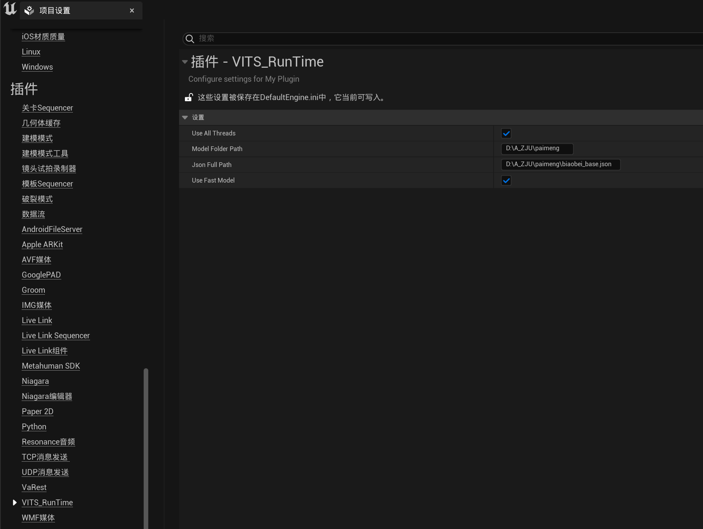

项目的下载地址在链接：https://pan.baidu.com/s/1wDMZMiRvqKQh5kNv6wC-YA?pwd=1234 

--------

下载目录说明：

下载目录下有GaussianDEMO和paimeng两个压缩包，其中GaussianDEMO压缩包是项目文件，使用虚幻引擎运行，虚幻引擎的版本>=5.1。
paimeng压缩包里面存放着vits相关文件

-----

项目运行教程：

项目需要在设置部分，将解压的paimeng压缩包的地址填入此处。然后才可以正常运行。

